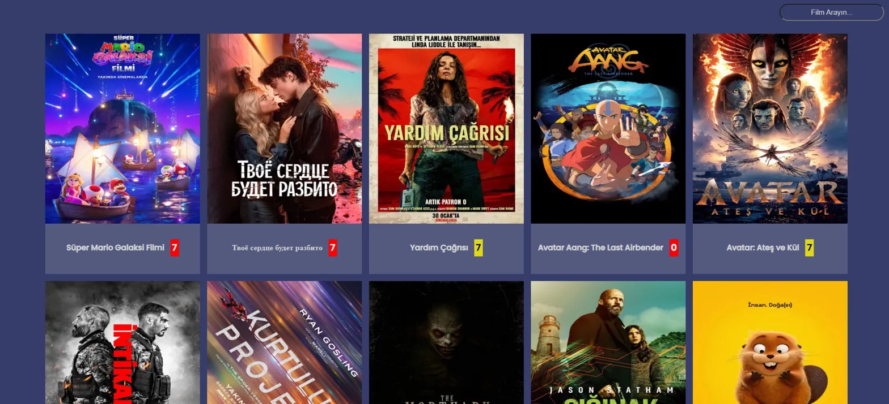
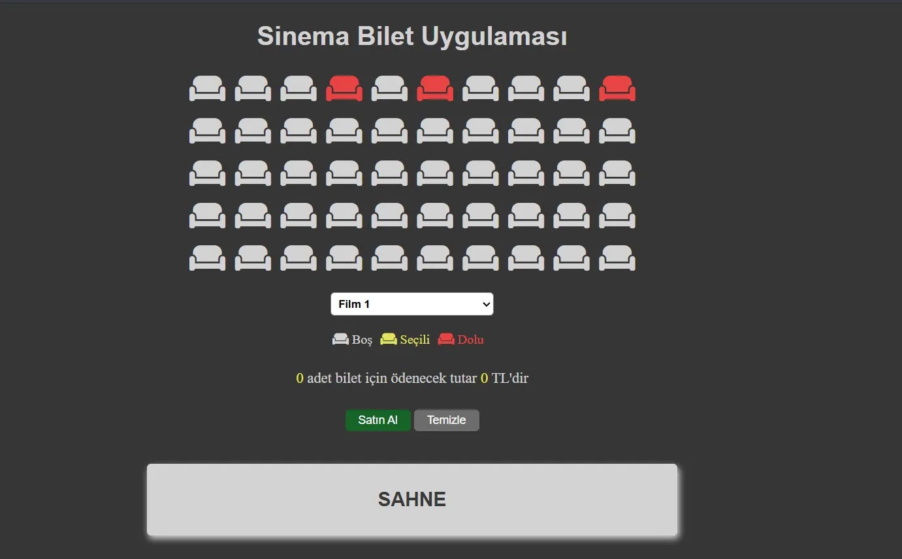
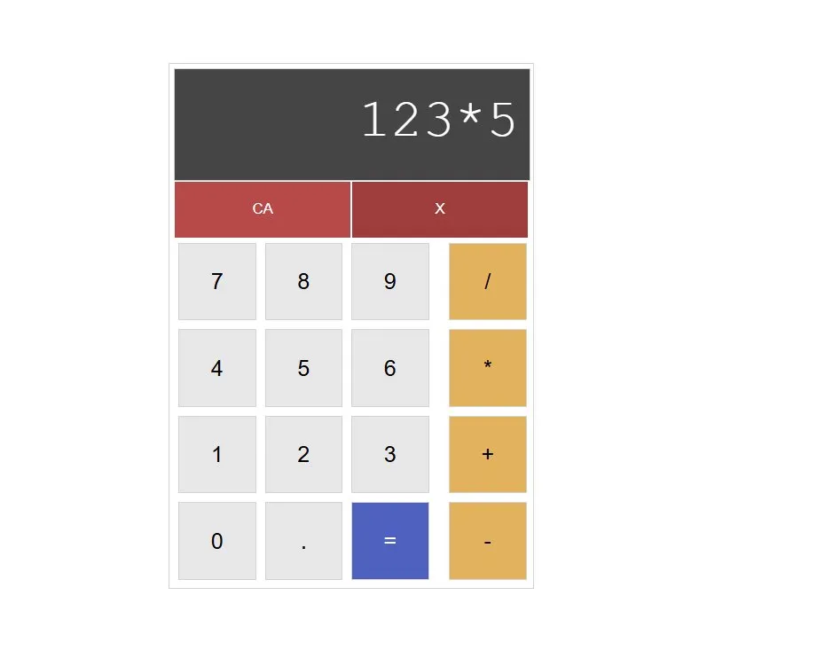
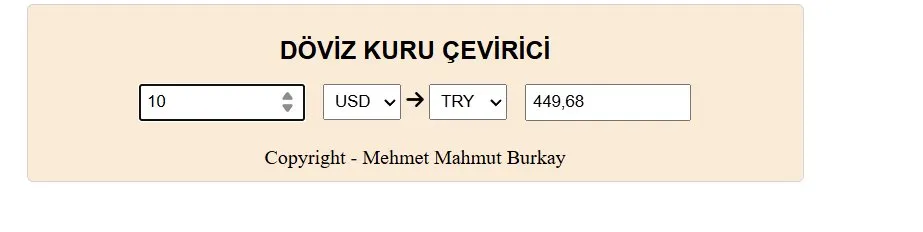
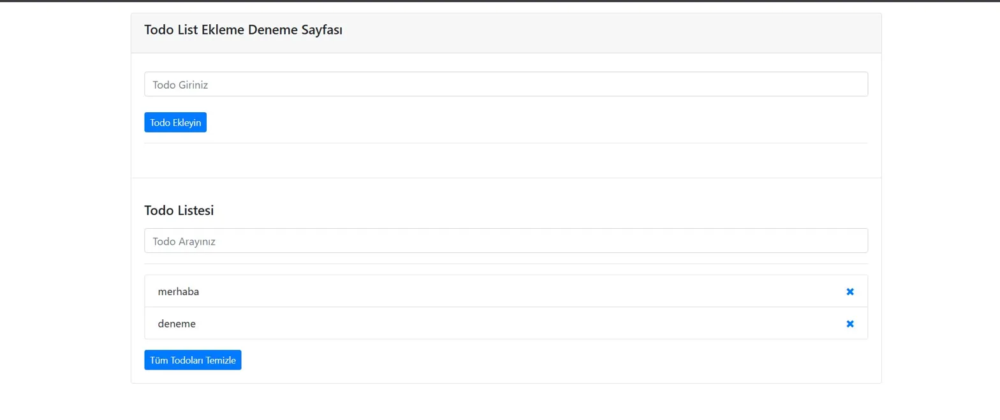
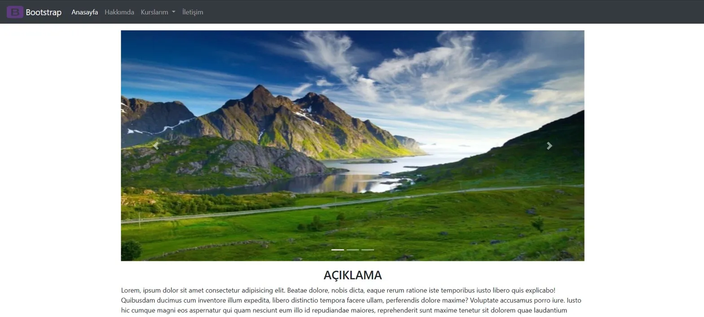
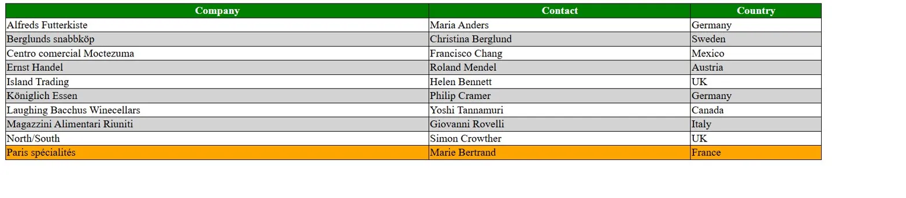

# 🌐 Web Geliştirme Eğitimi

Bu repo, [Enes Bayram](https://www.youtube.com/playlist?list=PLURN6mxdcwL_D8H1iki2YCmp-lNyNAdbz) tarafından hazırlanan **HTML, CSS, JavaScript ve Bootstrap** kursunu tamamladığım süreçte yazdığım ders notlarını ve proje kodlarını içermektedir.

---

## 📚 İçerik

| Klasör | Konu | Dosya Sayısı |
|--------|------|-------------|
| 📁 HTML | Temel HTML etiketleri, formlar, tablolar, medya | 13 ders |
| 📁 CSS | Seçiciler, kutu modeli, flexbox, animasyonlar | 18 ders |
| 📁 BOOTSTRAP | Grid, bileşenler, navbar, örnek site | 13 ders |
| 📁 JAVASCRIPT | Temelden ileri seviyeye JS + projeler | 78+ ders |

---

## 🚀 Projeler

### 🎬 Film Arama Uygulaması
API ile film arama, listeleme ve filtreleme yapabilen uygulama.

---

### 🎟️ Sinema Bilet Uygulaması
Koltuk seçimi yapılabilen, dolu/boş/seçili koltukları gösteren interaktif sinema uygulaması.

---

### 🌤️ Hava Durumu Uygulaması
Şehir bazlı hava durumu sorgulayan, API destekli hava durumu uygulaması.

---

### 🧮 Hesap Makinesi
Temel matematiksel işlemler yapabilen hesap makinesi uygulaması.

---

### 💱 Döviz Kuru Çevirici
Anlık döviz kurlarını çeken para birimi dönüştürücü uygulaması.

---

### ✅ Todo List Uygulaması
Görev ekleme, silme ve arama özellikli yapılacaklar listesi uygulaması.

---

### 🌐 Bootstrap Örnek Site
Navbar, carousel slider ve card bileşenlerinden oluşan çok sayfalı örnek web sitesi.

---

### 📊 CSS Tablo Örneği
Hover efekti ve zebra satır renklendirmesi içeren özelleştirilmiş CSS tablosu.

---

## 🛠️ Kullanılan Teknolojiler

---

## 📖 Öğrenilen Konular

### HTML
- Temel etiketler (p, h1-h6, div, span)
- Form elemanları ve input tipleri
- Tablo oluşturma
- Medya etiketleri (img, video, iframe)
- Inline ve Block elementler

### CSS
- ID ve Class seçiciler
- Renklendirme, border, border-radius
- Box model (margin, padding, width, height)
- Display özellikleri (inline, block, inline-block)
- Text ve font özellikleri
- CSS seçiciler ve pseudo-class'lar
- Z-index ve konumlandırma

### Bootstrap
- Grid sistemi ve layout
- Margin ve padding yardımcı sınıfları
- Alert, buton, card bileşenleri
- Tablo ve liste stilleri
- Form bileşenleri
- Navbar ve dropdown menü
- Carousel (slayt gösterisi)

### JavaScript
- Değişkenler, veri tipleri, operatörler
- Koşul ifadeleri ve döngüler
- Fonksiyonlar (parametreli, parametresiz, arrow)
- Diziler ve dizi metodları
- String ve Math metodları
- DOM manipülasyonu
- Event listeners (mouse, klavye, input)
- Session ve Local Storage
- ES6+ özellikleri (destructuring, spread, map, set, template literals)
- OOP (nesne, yapıcı metot, inheritance, static)
- Asenkron programlama
- Callback, Promise, Async/Await
- AJAX ve Fetch API

---

## 📺 Kurs Linki

[▶️ Enes Bayram - Web Geliştirme Kursu](https://www.youtube.com/playlist?list=PLURN6mxdcwL_D8H1iki2YCmp-lNyNAdbz)

---

## 👨‍💻 Geliştirici

**Mehmet Mahmut Burkay**  

